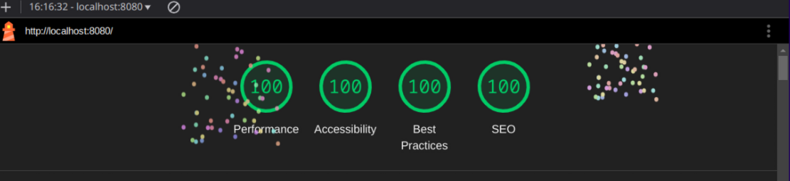
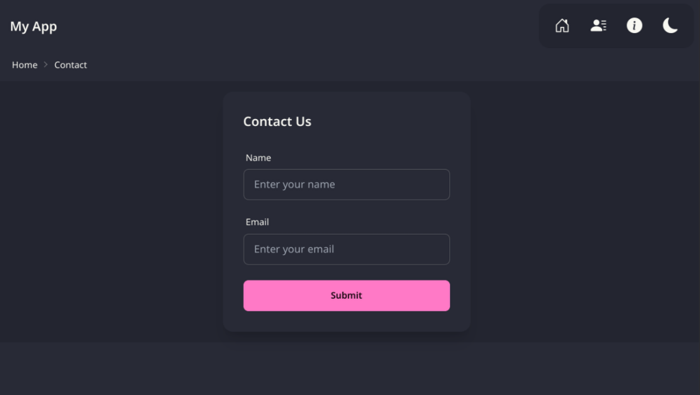
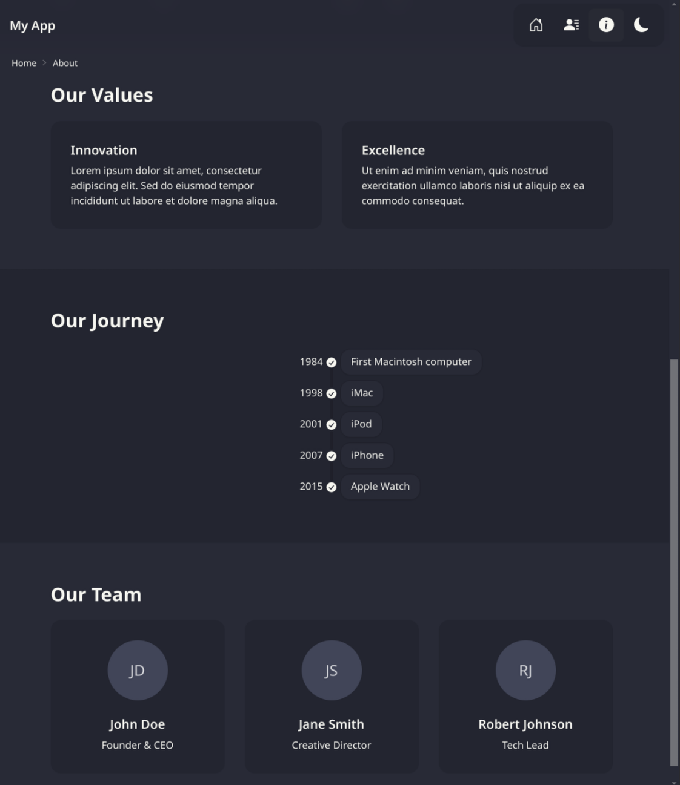
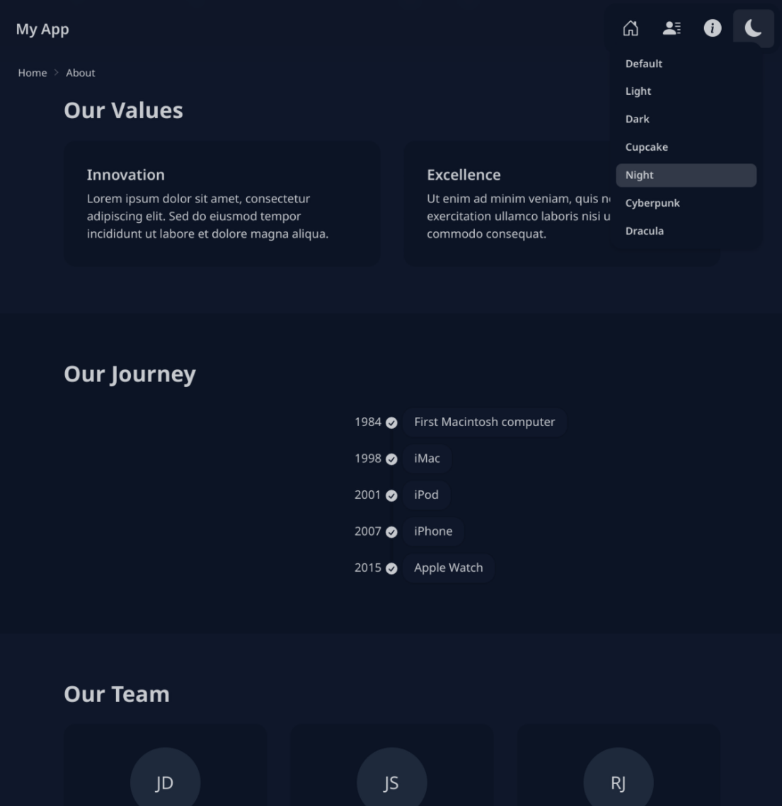

# A Template for Lit + Tailwind + Daisy + Bun

A starter template for a web app built with

<a href="https://lit.dev/" style="padding: 12px;"> Lit</a>
<a href="https://tailwindcss.com/" style="padding: 12px;"> Tailwind</a>
<a href="https://daisyui.com/" style="padding: 12px;"> Daisy UI</a>
<a href="https://bun.sh/" style="padding: 12px;"> Bun</a>

## Using this Repo

```bash
bun create github.com/dazraf/lit-tailwind-daisy-bun <your-directory-name>
cd <your-directory-name>
```

## Running the App

```bash
bun dev
```

## Building a Distribution

```bash
bun run build
```

## Features

- Nav Toolbar
- [Theme Selector](./src/components/ThemeSelector.ts)
- Routing for three pages using the [Lit Router](https://www.npmjs.com/package/@lit-labs/router): [`/`](./src/components/pages/HomePage.ts), [`/contact`](./src/components/pages/ContactPage.ts) and [`/about`](./src/components/pages/AboutPage.ts).
- Mixin class [`AppStyledElement.ts`](./src/components/AppStyledElement.ts) which gives you all the power of Tailwind and Daisy for Lit components
- [Bootstrap icons](https://icons.getbootstrap.com/) wrapped as a [web component](./src/components/Icon.ts)
- [Breadcrumbs](./src/components/Breadcrumbs.ts)
- 100% Lighthouse Score



## Screen Shots






